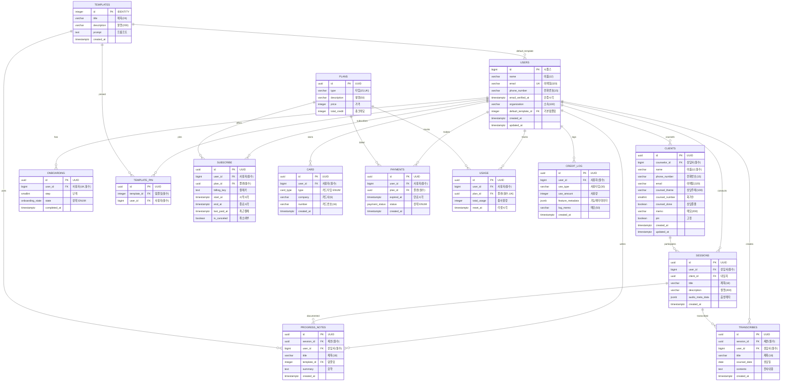
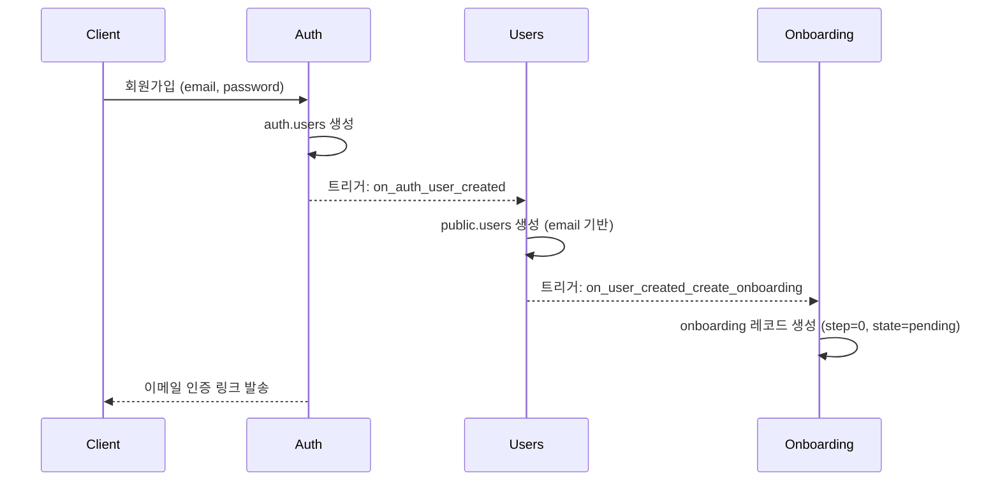
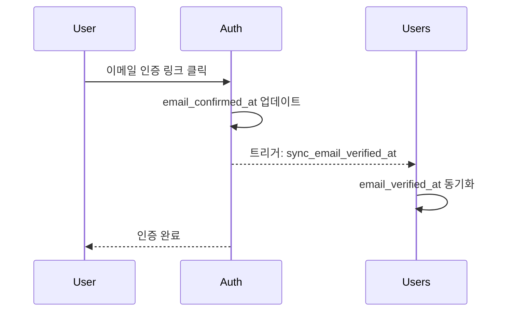
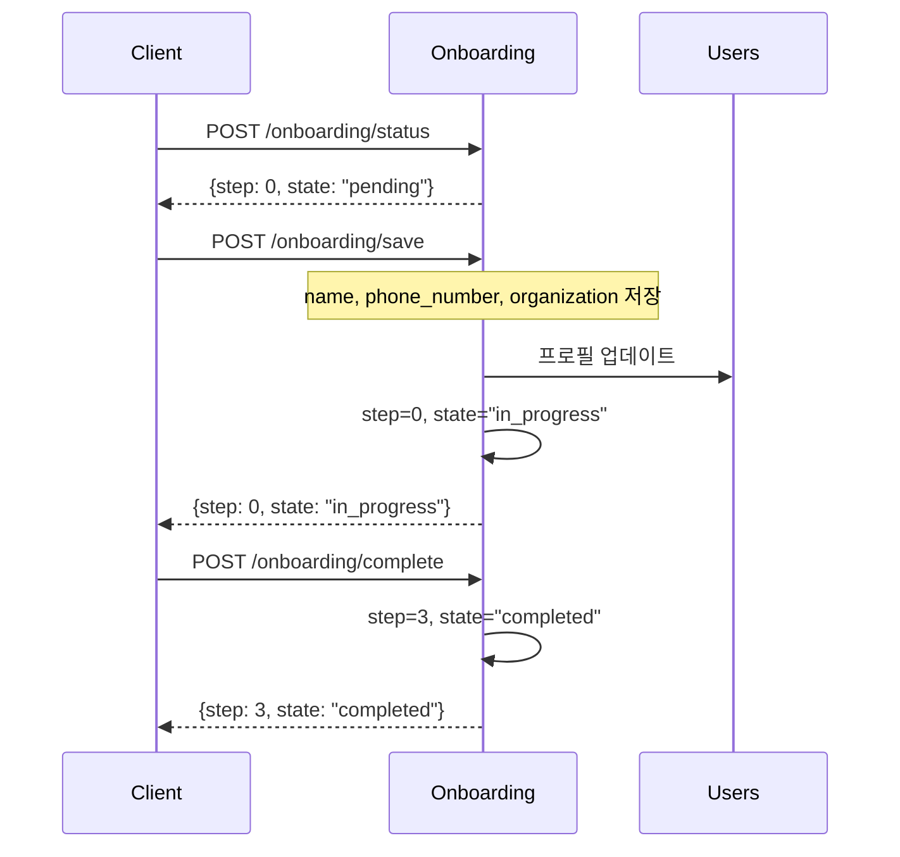
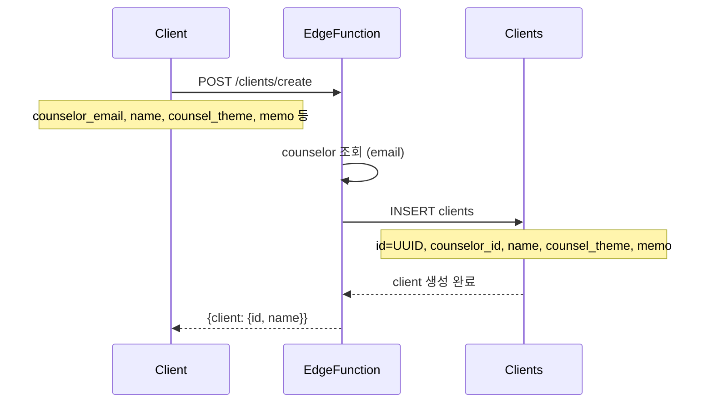
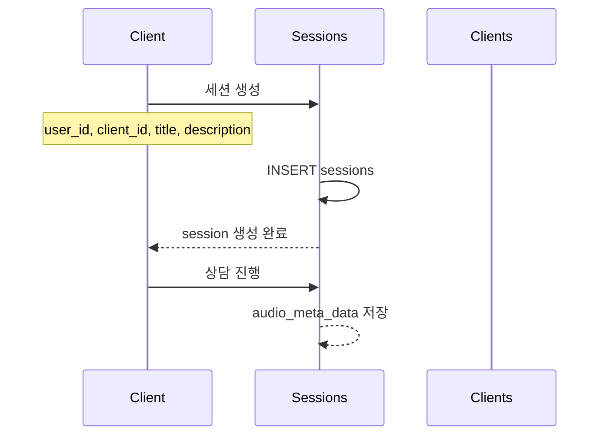

# Entity Relationship Diagram (ERD)

> Mindthos 데이터베이스의 엔티티 관계도입니다. 테이블 간 관계와 데이터 흐름을
> 시각화합니다.

## Mermaid ERD



---

## 핵심 데이터 흐름

### 1. 사용자 등록 플로우



### 2. 이메일 인증 플로우



### 3. 온보딩 플로우



### 4. 내담자 등록 플로우



### 5. 상담 세션 생성 플로우



---

## 관계 설명

### 1:N 관계

| 부모 테이블 | 자식 테이블    | 관계 설명                                                                          |
| ----------- | -------------- | ---------------------------------------------------------------------------------- |
| users       | clients        | 상담사 1명이 여러 내담자 관리                                                      |
| users       | sessions       | 상담사 1명이 여러 세션 진행                                                        |
| clients     | sessions       | 내담자 1명이 여러 세션 참여                                                        |
| sessions    | progress_notes | 세션 1개에 여러 경과 기록                                                          |
| sessions    | transcribes    | 세션 1개에 여러 전사 내용                                                          |
| templates   | template_pin   | 템플릿 1개가 여러 사용자에게 고정됨                                                |
| templates   | progress_notes | 템플릿 1개가 여러 경과 기록에 사용됨                                               |
| templates   | users          | 템플릿 1개가 여러 사용자의 기본 템플릿으로 설정됨                                  |
| users       | subscribe      | 사용자 1명이 여러 구독 이력                                                        |
| plans       | subscribe      | 플랜 1개에 여러 구독자                                                             |
| plans       | payments       | 플랜 1개에 여러 결제 이력                                                          |
| plans       | usage          | 플랜 1개에 여러 사용량 기록                                                        |
| users       | credit_log     | 사용자 1명이 여러 크레딧 로그 (session_id, subscribe_id는 feature_metadata에 포함) |

### 애플리케이션 레벨 참조

**Foreign Key가 없는 이유:**

- 유연성: 스키마 변경 용이
- 성능: FK 체크 오버헤드 제거
- 독립성: 마이크로서비스 아키텍처 대비

**참조 무결성 보장 방법:**

- Edge Function에서 조회 후 삽입
- 존재하지 않는 ID 참조 시 404 에러 반환
- 트랜잭션 사용 시 롤백 처리

---

## 인덱스 전략

### 1. 주요 조회 패턴

**사용자별 데이터 조회:**

```sql
-- 내담자 목록 조회
SELECT * FROM clients WHERE counselor_id = ? ORDER BY created_at DESC;
-- 인덱스: idx_clients_counselor_created_desc

-- 세션 목록 조회
SELECT * FROM sessions WHERE user_id = ? ORDER BY created_at DESC;
-- 인덱스: idx_sessions_user_client_created_desc
```

**내담자별 세션 조회:**

```sql
-- 특정 내담자의 세션 조회
SELECT * FROM sessions WHERE client_id = ? ORDER BY created_at DESC;
-- 인덱스: idx_sessions_client_created_desc
```

### 2. 인덱스 목록

| 테이블   | 인덱스명                              | 컬럼                                  | 타입        |
| -------- | ------------------------------------- | ------------------------------------- | ----------- |
| users    | users_pkey                            | id                                    | PRIMARY KEY |
| users    | users_email_key                       | email                                 | UNIQUE      |
| clients  | clients_pkey                          | id                                    | PRIMARY KEY |
| clients  | idx_clients_counselor_created_desc    | (counselor_id, created_at DESC)       | INDEX       |
| sessions | sessions_pkey                         | id                                    | PRIMARY KEY |
| sessions | idx_sessions_user_client_created_desc | (user_id, client_id, created_at DESC) | INDEX       |
| sessions | idx_sessions_client_created_desc      | (client_id, created_at DESC)          | INDEX       |

---

## ENUM 타입 정의

| ENUM 타입        | 값                              | 사용 테이블 |
| ---------------- | ------------------------------- | ----------- |
| onboarding_state | pending, in_progress, completed | onboarding  |
| payment_status   | in_progress, success, failed    | payments    |
| card_type        | 신용, 체크                      | card        |

---

## 주요 변경 이력

### v1.9 (2025-11-18)

- **중요 변경:** 통합 크레딧 시스템 도입
- PLANS: `audio_credit`, `summary_credit` → `total_credit` 통합
- USAGE: `audio_usage`, `summary_usage` → `total_usage` 통합
- CREDIT_LOG: `session_id`, `subscribe_id` 제거 → `feature_metadata`로 통합
- CREDIT_LOG: `feature_metadata` 컬럼 추가 (모든 메타데이터 JSONB 통합),
  `use_type` 길이 확장 (8→30)
- CREDIT_LOG: GIN 인덱스 추가 (JSONB 검색 성능 최적화)
- Row-level lock 기반 동시성 안전 크레딧 관리 시스템 구현
- Credit Manager Edge Function 추가 (POST /functions/v1/credit-manager)

### v1.8 (2025-11-18)

- clients.counsel_done 추가 (상담 종결 여부)
- user 헬퍼 함수 업데이트 (email_verified_at, organization, default_template_id
  반환 추가)

### v1.7 (2025-11-18)

- **중요 변경:** templates.id 시퀀스 → IDENTITY 변경 (타입 안정성 향상)
- 시퀀스 관리 불필요, SQL 표준 방식 적용

### v1.6 (2025-11-18)

- **중요 변경:** counsel_notes → progress_notes 테이블명 변경
- **중요 변경:** templates.id uuid → integer 변경 (운영자 관리 편의성 향상)
- **중요 변경:** template_id 참조 컬럼 모두 integer로 변경
- 기존 templates 데이터 삭제 및 초기화

### v1.5 (2025-11-18)

- users.default_template_id 추가 (사용자 기본 템플릿 설정)
- templates-users 관계 추가 (기본 템플릿)

### v1.4 (2025-11-18)

- **문서 수정:** 실제 데이터베이스 스키마에 맞춰 ERD 전면 수정
- ENUM 타입 정확히 반영 (onboarding_state, payment_status, card_type)
- templates, plans, subscribe, card, payments, usage, credit_log 스키마 정정
- counsel_notes.content → summary, transcribes.content → contents 수정
- 관계도 정확히 수정 (templates-users 관계 제거 등)

### v1.3 (2025-11-18)

- clients.counsel_theme 추가
- 상담 주제 UI 표시 개선

### v1.2 (2025-11-18)

- **중요 변경:** clients.id bigint → uuid 변경
- **중요 변경:** clients.group_id 제거 (동반인 개념 제거)
- sessions.group_id → sessions.client_id로 변경
- 내담자와 세션 1:1 매핑으로 단순화

### v1.1 (2025-11-14)

- users.email_verified_at 추가 (이메일 인증 상태 추적)
- users.organization 추가 (소속 기관)
- clients.email 추가

### v1.0 (2025-11-12)

- 초기 ERD 설계
- 14개 테이블 정의
- FK 제거 정책 확립
