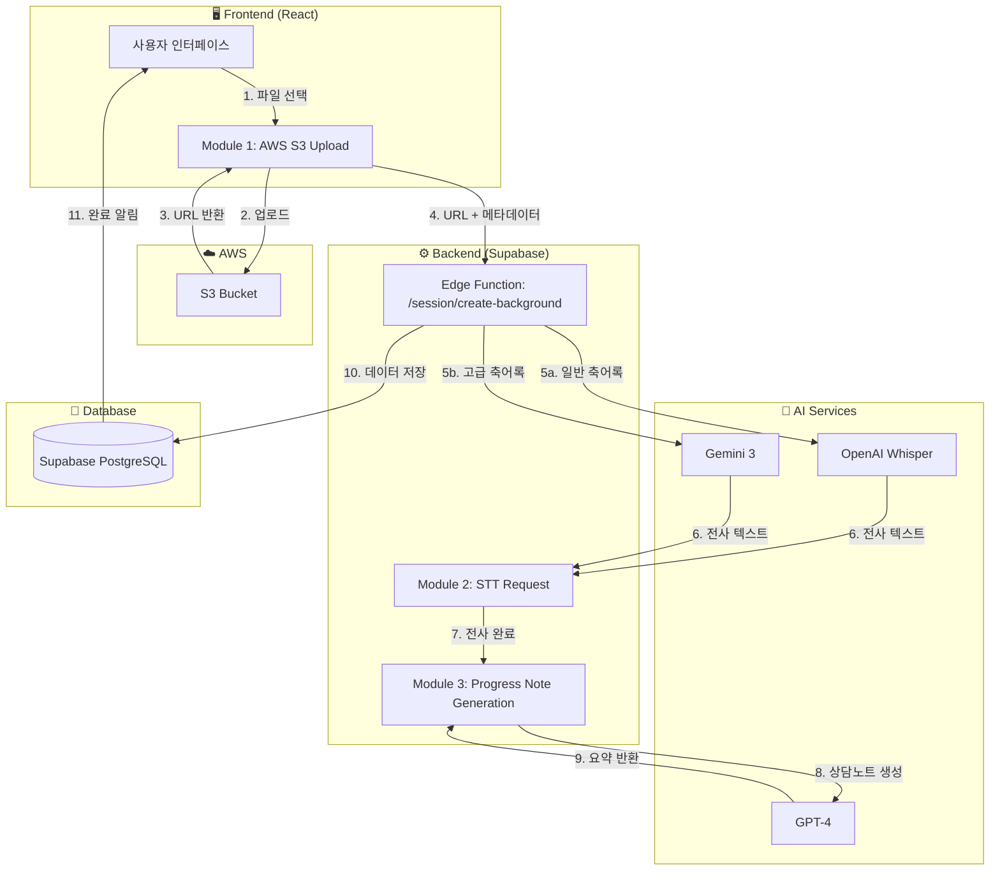
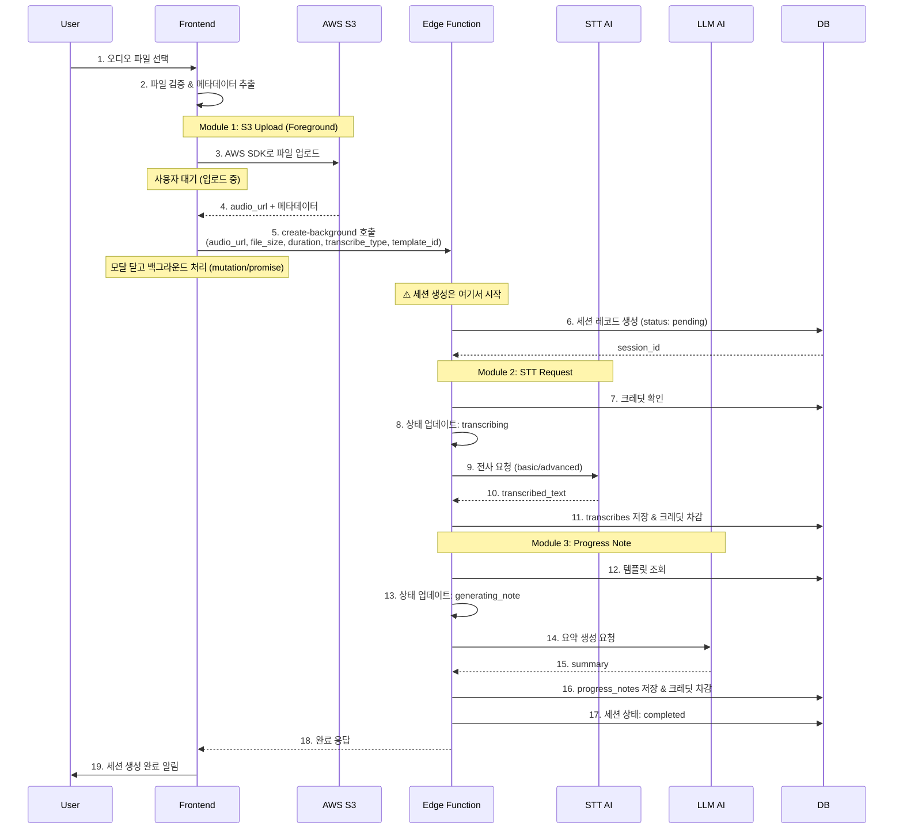
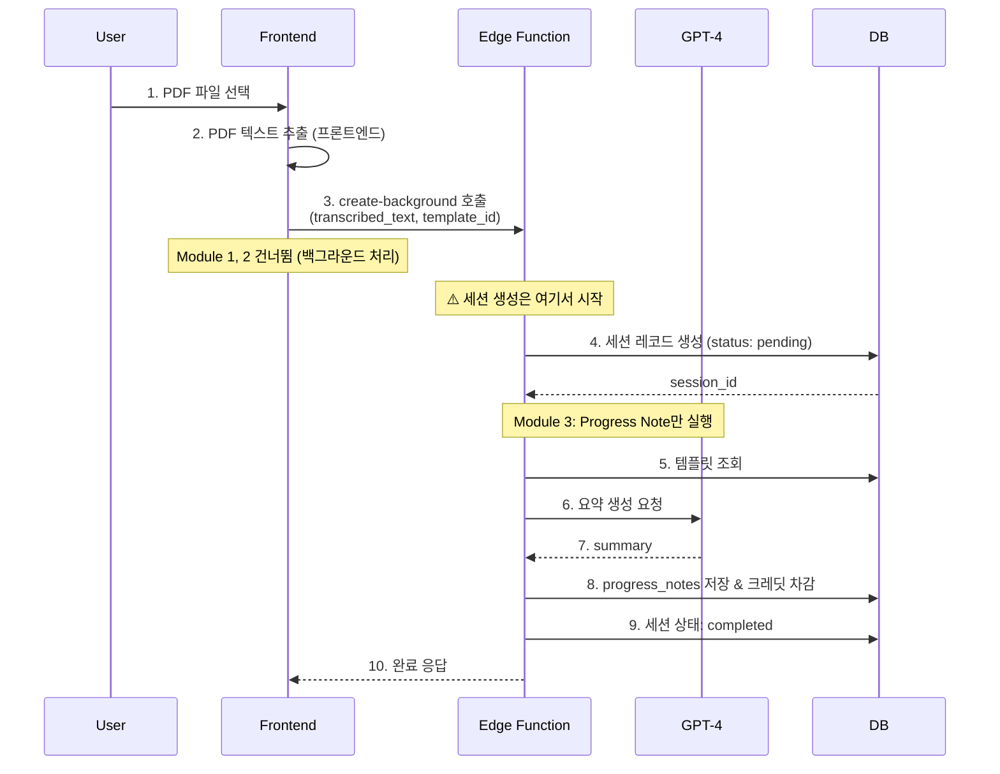
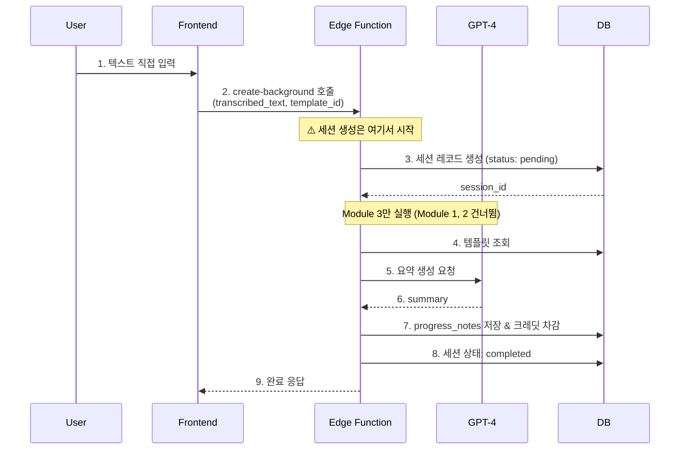

# 세션 생성 프로세스 기술 명세서

> Mindthos 세션 생성을 위한 전체 프로세스 및 모듈 정의
>
> 작성일: 2025-11-24 최종 수정: 2025-11-24

## 📋 목차

1. [개요](#개요)
2. [세션 생성 방법](#세션-생성-방법)
3. [아키텍처 구조](#아키텍처-구조)
4. [모듈별 상세 스펙](#모듈별-상세-스펙)
5. [데이터 플로우](#데이터-플로우)
6. [구현 순서](#구현-순서)

---

## 개요

### 핵심 원칙

- **모듈화**: 각 기능을 독립적인 모듈로 분리하여 재사용성 극대화
- **프론트엔드 업로드**: AWS S3 SDK를 사용하여 프론트엔드에서 직접 파일 업로드
- **백그라운드 처리**: STT 및 상담노트 생성은 Edge Function에서 백그라운드로
  처리
- **일관된 결과물**: 모든 세션 생성 방법은 동일한 최종 결과물(Session +
  Transcribe + ProgressNote) 생성

### 기술 스택

- **파일 저장소**: AWS S3 (오디오 파일만)
- **프론트엔드 업로드**: AWS SDK for JavaScript (v3)
- **백엔드 로직**: Supabase Edge Functions (Deno)
- **STT AI**: 일반 축어록 (OpenAI Whisper), 고급 축어록 (Gemini 3)
- **상담노트 생성 AI**: GPT-4 (고정)

---

## 세션 생성 방법

### 1️⃣ 음성파일 업로드 (Audio Upload)

```
사용자 입력: 오디오 파일 (MP3, WAV)
처리 플로우: S3 업로드 → STT (일반/고급) → 상담노트 생성
최종 결과: Session + Transcribe + ProgressNote
```

**특징:**

- 일반 축어록 / 고급 축어록 선택 가능
- STT 작업 필요 (크레딧 소비)
- 가장 복잡한 플로우 (3개 모듈 모두 사용)

### 2️⃣ PDF 업로드 (PDF Upload)

```
사용자 입력: PDF 파일
처리 플로우: PDF 텍스트 추출 → DB 저장 → 상담노트 생성
최종 결과: Session + ProgressNote
```

**특징:**

- 이미 문서화된 상담 내용 활용
- **S3 업로드 불필요** (Module 1 건너뜀)
- STT 작업 불필요 (Module 2 건너뜀)
- PDF 텍스트를 추출하여 문자열로 DB에 저장
- 직접 입력과 동일한 방식으로 처리

### 3️⃣ 직접 입력 (Direct Input)

```
사용자 입력: 텍스트 (직접 작성)
처리 플로우: 텍스트 DB 저장 → 상담노트 생성
최종 결과: Session + ProgressNote
```

**특징:**

- 파일 업로드 불필요 (Module 1 건너뜀)
- STT 작업 불필요 (Module 2 건너뜀)
- 가장 빠른 처리 (Module 3만 사용)
- 사용자가 입력한 텍스트를 그대로 DB에 저장

---

## 아키텍처 구조

### 시스템 다이어그램



### 모듈 분리 원칙

| 모듈        | 실행 위치 | 책임                         | 독립성                       |
| ----------- | --------- | ---------------------------- | ---------------------------- |
| Module 1    | Frontend  | S3 업로드 및 URL 획득        | ✅ 독립 실행 가능            |
| Module 2    | Backend   | STT 요청 및 전사             | ✅ URL만 있으면 독립 실행    |
| Module 3    | Backend   | 상담노트 생성                | ✅ 텍스트만 있으면 독립 실행 |
| Integration | Backend   | 모듈 연결 및 백그라운드 처리 | 위 모듈들 조합               |

---

## 모듈별 상세 스펙

### 📦 Module 1: AWS S3 Upload (Frontend + Backend)

**프론트엔드 위치**:
`mindthos_v2/src/feature/session/services/s3UploadService.ts` **백엔드 위치**:
`mindthos_db/supabase/functions/session/upload-url/index.ts`

**목적**: **Presigned URL 방식**을 사용하여 보안적으로 S3에 **오디오 파일만**
업로드하고 URL 획득

**⚠️ 중요**:

- PDF와 직접입력은 이 모듈을 사용하지 않음
- AWS 자격 증명은 백엔드에만 존재 (보안 강화)
- 프론트엔드는 제한된 시간(15분)의 업로드 권한을 가진 Presigned URL만 사용

#### 환경 변수 설정

**백엔드 (Supabase Edge Function):**

```env
AWS_REGION=ap-northeast-2
AWS_S3_BUCKET=mindthos-audio-files
AWS_ACCESS_KEY_ID=your-access-key  # 백엔드에서만 관리
AWS_SECRET_ACCESS_KEY=your-secret-key  # 백엔드에서만 관리
```

**프론트엔드:**

```env
# AWS 자격 증명 불필요 (Presigned URL 사용)
# Supabase 설정만 필요
VITE_WEBAPP_SUPABASE_URL=your-supabase-url
VITE_WEBAPP_SUPABASE_ANON_KEY=your-supabase-anon-key
```

#### 입력

```typescript
interface UploadToS3Request {
  file: File; // 업로드할 파일
  user_id: number; // 사용자 ID
  onProgress?: (progress: number) => void; // 업로드 진행률 콜백
}
```

#### 출력

```typescript
interface UploadToS3Response {
  success: boolean;
  message?: string;
  audio_url: string; // S3 Public URL
  file_path: string; // S3 key (경로)
  file_size_mb: number; // 파일 크기 (MB)
  duration_seconds?: number; // 오디오 길이 (초, 오디오만)
}
```

#### 처리 플로우 (Presigned URL 방식)

```typescript
// === 프론트엔드 ===

// 1. 파일 검증
- 크기: 최대 2GB (1시간 이상의 오디오 파일 고려, 압축 권장)
- 포맷: MP3, WAV, M4A (오디오만)

// 2. 오디오 메타데이터 추출
- Audio API로 duration 추출

// 3. 백엔드에 Presigned URL 요청
POST /functions/v1/session/upload-url
{
  user_id: 123,
  filename: "recording.mp3",
  content_type: "audio/mpeg"
}

// === 백엔드 (Edge Function) ===

// 4. S3 Key 생성 (백엔드)
- 패턴: `audio/{user_id}/{timestamp}_{filename}`
- 예시: `audio/123/1700000000000_recording.mp3`
- ⚠️ 주의: session_id 제외 (업로드 시점에는 세션이 아직 생성되지 않음)

// 5. AWS SDK로 Presigned URL 생성 (백엔드)
- S3Client + getSignedUrl 사용
- 유효 시간: 15분
- PutObject 권한만 부여

// 6. Presigned URL 반환
{
  presigned_url: "https://bucket.s3.region.amazonaws.com/key?signature=...",
  s3_key: "audio/123/1700000000000_recording.mp3",
  public_url: "https://bucket.s3.region.amazonaws.com/audio/123/...",
  expires_in: 900  // 15분
}

// === 프론트엔드 ===

// 7. Presigned URL로 HTTP PUT 요청하여 업로드
- XMLHttpRequest 사용 (진행률 추적)
- Content-Type 헤더 설정
- 파일 바이너리 전송

// 8. 업로드 완료 후 public_url 반환
```

#### 에러 처리

```typescript
enum S3UploadErrorCode {
  FILE_TOO_LARGE = 'FILE_TOO_LARGE', // 파일 크기 초과
  INVALID_FILE_TYPE = 'INVALID_FILE_TYPE', // 지원하지 않는 파일 타입
  UPLOAD_FAILED = 'UPLOAD_FAILED', // 업로드 실패
  AWS_CREDENTIALS_ERROR = 'AWS_CREDENTIALS_ERROR', // AWS 인증 오류
  NETWORK_ERROR = 'NETWORK_ERROR', // 네트워크 오류
}
```

#### 사용 예시

**프론트엔드:**

```typescript
import { s3UploadService } from '@/feature/session/services/s3UploadService';

// Presigned URL 방식으로 업로드 (AWS 자격 증명 불필요)
const result = await s3UploadService.uploadAudio({
  file: audioFile,
  user_id: 123,
  onProgress: (progress) => console.log(`${progress}% 완료`),
});

console.log(result.audio_url); // https://bucket.s3.region.amazonaws.com/audio/123/1700000000000_recording.mp3
```

**백엔드 (Edge Function):**

```typescript
// Deno에서 npm 패키지 사용
import { S3Client, PutObjectCommand } from 'npm:@aws-sdk/client-s3@3';
import { getSignedUrl } from 'npm:@aws-sdk/s3-request-presigner@3';

// Presigned URL 생성 (15분 유효)
const presignedUrl = await getSignedUrl(s3Client, command, { expiresIn: 900 });
```

---

### 🎙️ Module 2: STT Request (Backend Edge Function)

**위치**: `mindthos_db/supabase/functions/session/modules/stt.ts`

**목적**: 오디오 URL을 받아서 AI STT 서비스로 전사 요청 및 결과 저장

#### 입력

```typescript
interface STTRequest {
  audio_url: string; // S3에 업로드된 오디오 URL
  session_id: string; // 세션 ID
  user_id: number; // 사용자 ID
  transcribe_type: 'basic' | 'advanced'; // 축어록 타입
  duration_seconds: number; // 오디오 길이 (초)
  file_size_mb: number; // 파일 크기 (MB)
}
```

#### 출력

```typescript
interface STTResponse {
  success: boolean;
  message?: string;
  transcribe_id: string; // 생성된 전사 ID (UUID)
  transcribed_text: string; // 전사된 전체 텍스트
  credit_used: number; // 사용된 크레딧
  remaining_credit: number; // 남은 크레딧
}
```

#### 축어록 타입별 STT 서비스

| 타입         | AI 서비스      | API                        | 특징                              | 크레딧 소비                           |
| ------------ | -------------- | -------------------------- | --------------------------------- | ------------------------------------- |
| **basic**    | OpenAI Whisper | `/v1/audio/transcriptions` | - 빠른 처리<br>- 기본 정확도      | **1분당 1 크레딧**                    |
| **advanced** | Gemini 3       | Gemini API                 | - 높은 정확도<br>- 상담 특화 모델 | **1분당 1.5 크레딧**<br>(반내림 처리) |

**크레딧 계산 예시:**

```typescript
// 일반 축어록 (basic)
duration: 185초 (3.08분) → Math.ceil(185/60) * 1 = 4 크레딧

// 고급 축어록 (advanced)
duration: 185초 (3.08분) → Math.floor(Math.ceil(185/60) * 1.5) = Math.floor(4.5) = 4 크레딧
duration: 240초 (4.00분) → Math.floor(Math.ceil(240/60) * 1.5) = Math.floor(6) = 6 크레딧
duration: 300초 (5.00분) → Math.floor(Math.ceil(300/60) * 1.5) = Math.floor(7.5) = 7 크레딧
```

#### 처리 로직

```typescript
// 1. 크레딧 계산
const durationMinutes = Math.ceil(duration_seconds / 60);
let creditNeeded: number;

if (transcribe_type === 'basic') {
  // 일반 축어록: 1분당 1 크레딧
  creditNeeded = durationMinutes * 1;
} else {
  // 고급 축어록: 1분당 1.5 크레딧, 반내림
  creditNeeded = Math.floor(durationMinutes * 1.5);
}

// 2. 크레딧 확인
const creditInfo = await getCreditInfo(user_id);
if (creditInfo.remaining_credit < creditNeeded) {
  throw new Error('INSUFFICIENT_CREDIT');
}

// 3. STT AI 서비스 선택 및 요청
if (transcribe_type === 'basic') {
  // OpenAI Whisper API 호출
  const response = await openai.audio.transcriptions.create({
    file: audio_url,
    model: 'whisper-1',
    language: 'ko',
  });
} else {
  // Gemini 3 API 호출
  const response = await fetch(GEMINI_STT_ENDPOINT, {
    method: 'POST',
    body: JSON.stringify({
      audio_url,
      model: 'gemini-3',
      language: 'ko',
    }),
  });
}

// 4. transcribes 테이블에 저장
const transcribe = await db.from('transcribes').insert({
  id: uuid(),
  session_id,
  user_id,
  title: `전사 기록 ${new Date().toLocaleDateString()}`,
  counsel_date: new Date().toISOString().split('T')[0],
  stt_model: transcribe_type === 'basic' ? 'whisper' : 'gemini-3', // STT 모델 저장 (UI 구분용)
  contents: JSON.stringify({
    audio_uuid: session_id,
    status: 'completed',
    result: {
      text: response.text,
    },
  }),
});

// 5. 크레딧 차감
await callEdgeFunction('/credit-manager', {
  user_id,
  credit_amount: creditNeeded,
  use_type: 'audio_transcribe',
  feature_metadata: {
    session_id,
    duration_seconds,
    file_size_mb,
    transcribe_type,
    calculated_cost: creditNeeded,
  },
});

// 6. 결과 반환
return {
  success: true,
  transcribe_id: transcribe.id,
  transcribed_text: response.text,
  credit_used: creditNeeded,
  remaining_credit: creditInfo.remaining_credit - creditNeeded,
};
```

#### 에러 처리

```typescript
enum STTErrorCode {
  INSUFFICIENT_CREDIT = 'INSUFFICIENT_CREDIT', // 크레딧 부족
  INVALID_AUDIO_URL = 'INVALID_AUDIO_URL', // 유효하지 않은 오디오 URL
  AUDIO_DOWNLOAD_FAILED = 'AUDIO_DOWNLOAD_FAILED', // 오디오 다운로드 실패
  STT_API_ERROR = 'STT_API_ERROR', // STT API 오류
  TRANSCRIBE_FAILED = 'TRANSCRIBE_FAILED', // 전사 실패
  DATABASE_ERROR = 'DATABASE_ERROR', // DB 저장 오류
}
```

---

### 📝 Module 3: Progress Note Generation (Backend Edge Function)

**위치**: `mindthos_db/supabase/functions/session/modules/progressNote.ts`

**목적**: 전사된 텍스트와 템플릿 프롬프트를 사용하여 상담 노트 생성

#### 입력

```typescript
interface GenerateProgressNoteRequest {
  session_id: string; // 세션 ID
  user_id: number; // 사용자 ID
  template_id: number; // 사용할 템플릿 ID
  transcribed_text: string; // 전사된 텍스트 (또는 PDF/직접입력 텍스트)
}
```

#### 출력

```typescript
interface GenerateProgressNoteResponse {
  success: boolean;
  message?: string;
  progress_note_id: string; // 생성된 상담 노트 ID (UUID)
  summary: string; // 생성된 상담 요약
  credit_used: number; // 사용된 크레딧
  remaining_credit: number; // 남은 크레딧
}
```

#### 처리 로직

```typescript
// 1. 템플릿 조회
const template = await db
  .from('templates')
  .select('*')
  .eq('id', template_id)
  .single();

if (!template) {
  throw new Error('TEMPLATE_NOT_FOUND');
}

// 2. 크레딧 계산 및 확인
// TODO: 상담노트 생성 크레딧 고정값 (나중에 조정 가능)
const creditNeeded = 5; // 고정 크레딧 (향후 조정 필요 시 이 값만 수정)

// credit-manager로 크레딧 확인
const creditInfo = await getCreditInfo(user_id);
if (creditInfo.remaining_credit < creditNeeded) {
  throw new Error('INSUFFICIENT_CREDIT');
}

// 3. LLM 프롬프트 구성
const prompt = `
${template.prompt}

[상담 내용]
${transcribed_text}

위 상담 내용을 바탕으로 상담 기록을 작성해주세요.
`;

// 4. GPT-4 API 호출 (고정)
const response = await openai.chat.completions.create({
  model: 'gpt-4',
  messages: [
    { role: 'system', content: '당신은 전문 상담 기록 작성자입니다.' },
    { role: 'user', content: prompt },
  ],
  temperature: 0.7,
  max_tokens: 2000,
});

const summary = response.choices[0].message.content;

// 5. progress_notes 테이블에 저장
const progressNote = await db.from('progress_notes').insert({
  id: uuid(),
  session_id,
  user_id,
  title: `상담 기록 ${new Date().toLocaleDateString()}`,
  template_id,
  summary,
});

// 6. 크레딧 차감
await callEdgeFunction('/credit-manager', {
  user_id,
  credit_amount: creditNeeded,
  use_type: 'summary_generate',
  feature_metadata: {
    session_id,
    text_length: textLength,
    template_id,
  },
});

// 7. 결과 반환
return {
  success: true,
  progress_note_id: progressNote.id,
  summary,
  credit_used: creditNeeded,
  remaining_credit: creditInfo.remaining_credit - creditNeeded,
};
```

#### 크레딧 계산 규칙

```typescript
// TODO: 상담노트 생성 크레딧 고정값 (나중에 조정 가능)
const PROGRESS_NOTE_CREDIT = 5; // 고정 크레딧

// 예시:
// - 모든 상담 노트 생성: 5 크레딧 (고정)
// ⚠️ 이 값은 향후 조정이 필요할 수 있으므로 TODO로 표시
```

#### 에러 처리

```typescript
enum ProgressNoteErrorCode {
  TEMPLATE_NOT_FOUND = 'TEMPLATE_NOT_FOUND', // 템플릿 없음
  INSUFFICIENT_CREDIT = 'INSUFFICIENT_CREDIT', // 크레딧 부족
  LLM_API_ERROR = 'LLM_API_ERROR', // LLM API 오류
  GENERATION_FAILED = 'GENERATION_FAILED', // 생성 실패
  DATABASE_ERROR = 'DATABASE_ERROR', // DB 저장 오류
}
```

---

### 🔗 Integration: Background Session Creation

**위치**: `mindthos_db/supabase/functions/session/create-background/index.ts`

**목적**: 위의 모듈들을 연결하여 세션을 백그라운드에서 생성

#### API Endpoint

```
POST /functions/v1/session/create-background
```

#### 입력

```typescript
interface CreateSessionBackgroundRequest {
  // ⚠️ 주의: session_id는 Edge Function에서 생성됨 (요청에 포함되지 않음)
  user_id: number; // 사용자 ID
  client_id?: string; // 내담자 ID (선택)
  upload_type: 'audio' | 'pdf' | 'direct'; // 업로드 타입

  // === 오디오인 경우 ===
  audio_url?: string; // S3 URL (Module 1에서 받음)
  file_size_mb?: number; // 파일 크기
  transcribe_type?: 'basic' | 'advanced'; // 축어록 타입
  duration_seconds?: number; // 오디오 길이

  // === PDF/직접 입력인 경우 ===
  transcribed_text?: string; // PDF 추출 텍스트 또는 직접 입력한 텍스트

  // === 공통 ===
  template_id: number; // 템플릿 ID
}
```

#### 출력

```typescript
interface CreateSessionBackgroundResponse {
  success: boolean;
  message: string;
  session_id: string;

  // 처리 완료 시
  transcribe_id?: string; // 전사 ID (오디오만)
  progress_note_id?: string; // 상담 노트 ID
  total_credit_used?: number; // 총 사용 크레딧
  remaining_credit?: number; // 남은 크레딧
}
```

#### 처리 플로우

```typescript
// === 음성파일 업로드 플로우 ===
if (upload_type === 'audio') {
  // 0. 세션 레코드 생성 (가장 먼저!)
  const session = await db
    .from('sessions')
    .insert({
      id: uuid(),
      user_id,
      client_id,
      processing_status: 'pending',
    })
    .single();
  const session_id = session.id;

  // 1. Module 2: STT 요청
  const sttResult = await executeSTT({
    audio_url,
    session_id,
    user_id,
    transcribe_type,
    duration_seconds,
    file_size_mb,
  });

  // 2. Module 3: 상담 노트 생성
  const noteResult = await generateProgressNote({
    session_id,
    user_id,
    template_id,
    transcribed_text: sttResult.transcribed_text,
  });

  // 3. 세션 상태 업데이트
  await updateSessionStatus(session_id, 'completed');

  return {
    success: true,
    message: '세션이 성공적으로 생성되었습니다.',
    session_id,
    transcribe_id: sttResult.transcribe_id,
    progress_note_id: noteResult.progress_note_id,
    total_credit_used: sttResult.credit_used + noteResult.credit_used,
    remaining_credit: noteResult.remaining_credit,
  };
}

// === PDF 업로드 플로우 ===
else if (upload_type === 'pdf') {
  // ⚠️ PDF는 S3 업로드 없이 프론트엔드에서 텍스트 추출
  // transcribed_text에 이미 추출된 텍스트가 전달됨

  // 0. 세션 레코드 생성 (가장 먼저!)
  const session = await db
    .from('sessions')
    .insert({
      id: uuid(),
      user_id,
      client_id,
      processing_status: 'pending',
    })
    .single();
  const session_id = session.id;

  // 1. Module 3: 상담 노트 생성
  const noteResult = await generateProgressNote({
    session_id,
    user_id,
    template_id,
    transcribed_text, // 프론트에서 추출된 텍스트
  });

  // 2. 세션 상태 업데이트
  await updateSessionStatus(session_id, 'completed');

  return {
    success: true,
    message: '세션이 성공적으로 생성되었습니다.',
    session_id,
    progress_note_id: noteResult.progress_note_id,
    total_credit_used: noteResult.credit_used,
    remaining_credit: noteResult.remaining_credit,
  };
}

// === 직접 입력 플로우 ===
else if (upload_type === 'direct') {
  // 0. 세션 레코드 생성 (가장 먼저!)
  const session = await db
    .from('sessions')
    .insert({
      id: uuid(),
      user_id,
      client_id,
      processing_status: 'pending',
    })
    .single();
  const session_id = session.id;

  // 1. Module 3: 상담 노트 생성
  const noteResult = await generateProgressNote({
    session_id,
    user_id,
    template_id,
    transcribed_text,
  });

  // 2. 세션 상태 업데이트
  await updateSessionStatus(session_id, 'completed');

  return {
    success: true,
    message: '세션이 성공적으로 생성되었습니다.',
    session_id,
    progress_note_id: noteResult.progress_note_id,
    total_credit_used: noteResult.credit_used,
    remaining_credit: noteResult.remaining_credit,
  };
}
```

#### 상태 관리

세션 처리 상태를 추적하기 위한 필드 (DB 마이그레이션 필요):

```sql
-- sessions 테이블에 추가할 컬럼
ALTER TABLE sessions ADD COLUMN processing_status VARCHAR(20) DEFAULT 'pending';
ALTER TABLE sessions ADD COLUMN error_message TEXT;

-- 가능한 상태값
-- 'pending': 세션 생성됨, 처리 대기
-- 'uploading': 파일 업로드 중 (프론트엔드)
-- 'transcribing': STT 처리 중 (Module 2)
-- 'generating_note': 상담노트 생성 중 (Module 3)
-- 'completed': 완료
-- 'failed': 실패
```

---

## 데이터 플로우

### 🎵 음성파일 업로드 플로우 (가장 복잡)



### 📄 PDF 업로드 플로우 (S3 업로드 없음)



### ✍️ 직접 입력 플로우 (가장 간단)



---

## 구현 순서

### Phase 1: Module 1 구현 (Frontend - AWS S3 Upload)

**작업 항목:**

- [ ] AWS SDK 설치 및 설정
- [ ] S3 업로드 서비스 구현 (`s3UploadService.ts`)
- [ ] 업로드 진행률 UI 컴포넌트
- [ ] 에러 처리 및 재시도 로직

**산출물:**

```
mindthos_v2/src/feature/session/services/s3UploadService.ts
mindthos_v2/src/feature/session/types/s3Upload.types.ts
mindthos_v2/src/feature/session/hooks/useS3Upload.ts
```

### Phase 2: Module 2 구현 (Backend - STT Request)

**작업 항목:**

- [ ] STT 모듈 구현 (`stt.ts`)
- [ ] OpenAI Whisper API 연동
- [ ] Custom Advanced STT API 연동
- [ ] transcribes 테이블 저장 로직
- [ ] 크레딧 차감 연동

**산출물:**

```
mindthos_db/supabase/functions/session/modules/stt.ts
mindthos_db/supabase/functions/session/types/stt.types.ts
```

### Phase 3: Module 3 구현 (Backend - Progress Note Generation)

**작업 항목:**

- [ ] 상담노트 생성 모듈 구현 (`progressNote.ts`)
- [ ] 템플릿 조회 로직
- [ ] GPT-4 API 연동 (고정)
- [ ] progress_notes 테이블 저장 로직
- [ ] 크레딧 계산 및 차감

**산출물:**

```
mindthos_db/supabase/functions/session/modules/progressNote.ts
mindthos_db/supabase/functions/session/types/progressNote.types.ts
```

### Phase 4: Integration 구현 (Backend - Background Session Creation)

**작업 항목:**

- [ ] 통합 Edge Function 구현 (`create-background/index.ts`)
- [ ] 3가지 플로우 분기 처리
- [ ] 상태 관리 로직
- [ ] 에러 핸들링 및 롤백
- [ ] DB 마이그레이션 (processing_status 추가)

**산출물:**

```
mindthos_db/supabase/functions/session/create-background/index.ts
mindthos_db/supabase/migrations/[timestamp]_add_session_processing_status.sql
```

### Phase 5: Frontend 통합 및 UI

**작업 항목:**

- [ ] 세션 생성 훅 구현 (`useCreateSession.ts`)
- [ ] 3가지 입력 방법 UI 구현
- [ ] 진행 상태 표시 UI
- [ ] 완료/에러 알림
- [ ] 크레딧 잔액 표시

**산출물:**

```
mindthos_v2/src/feature/session/hooks/useCreateSession.ts
mindthos_v2/src/feature/session/components/CreateSessionFlow.tsx
```

---

## 변경 이력

### v1.3 (2025-11-24) - 보안 강화 (Presigned URL)

- 🔒 **보안 개선**: AWS 자격 증명을 프론트엔드에서 백엔드로 이동
- 🔒 **Presigned URL 방식 도입**:
  - 프론트엔드에서 AWS SDK 제거
  - 백엔드 Edge Function에서 제한된 시간(15분)의 업로드 권한을 가진 URL 생성
  - 특정 파일에만 접근 가능하도록 권한 제한
- 🆕 **신규 Edge Function**: `/session/upload-url` - Presigned URL 생성
- 📝 **문서 업데이트**: Module 1 섹션에 Presigned URL 플로우 반영

### v1.2 (2025-11-24) - 핵심 아키텍처 수정

- 🔄 **세션 생성 타이밍 변경**: S3 업로드 완료 후 Edge Function에서 세션 생성
  (이전: 업로드 전 세션 생성)
- 🔄 **S3 업로드 요청 수정**: `session_id` 파라미터 제거 (업로드 시점에 세션
  미존재)
- 🔄 **S3 Key 패턴 변경**: `audio/{user_id}/{timestamp}_{filename}` (session_id
  제외)
- 🔄 **파일 크기 제한 확대**: 500MB → 2GB (1시간 이상 오디오 파일 지원)
- 🔄 **STT 모델 저장**: transcribes 테이블에 `stt_model` 필드 추가 (UI 구분용)
- 🔄 **상담노트 크레딧 변경**: 변동 크레딧 → 고정 크레딧 (5 크레딧, TODO 주석
  포함)
- 🔄 **플로우 다이어그램 업데이트**: 모든 시퀀스 다이어그램에서 세션 생성이 Edge
  Function 내부에서 발생하도록 수정

### v1.1 (2025-11-24) - 수정사항 반영

- 🔄 **PDF 업로드 방식 변경**: S3 업로드 제거, 프론트엔드에서 텍스트 추출 후
  직접 전달
- 🔄 **STT 모델 명확화**:
  - 일반 축어록: OpenAI Whisper
  - 고급 축어록: Gemini 3
  - 화자 분리 기능 제거 (단순 모델 차이만)
- 🔄 **고급 축어록 크레딧 변경**: 1분당 2 크레딧 → 1분당 1.5 크레딧 (반내림
  처리)
- 🔄 **상담노트 AI 고정**: GPT-4만 사용 (Claude 선택 제거)
- 🔄 PDF 플로우 다이어그램 수정 (S3 업로드 단계 제거)

### v1.0 (2025-11-24)

- ✅ 초기 문서 작성
- ✅ 3가지 세션 생성 방법 정의
- ✅ 모듈 구조 설계 (Module 1, 2, 3 + Integration)
- ✅ AWS S3 업로드 스펙 정의
- ✅ 프론트엔드 직접 업로드 방식으로 변경
- ✅ STT 모듈 상세 스펙 정의
- ✅ 상담노트 생성 모듈 스펙 정의
- ✅ 백그라운드 통합 로직 스펙 정의
- ✅ 데이터 플로우 다이어그램 작성
- ✅ 구현 순서 정의

---

**작성자**: Claude Code **검토자**: 김경민 **최종 수정**: 2025-11-24
